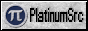
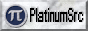
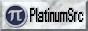

{::options parse_block_html="true" /}

## 88x31 Badges

**Free** 

**Get** 

**Powered by** 

**Logo and text** 

 

**Text only** 

**Miscellaneous** 

---

## [MakeSweet](https://makesweet.com/) GIFs

[Heart Locket](locket.gif) 
[Circuit board](board.gif)

---

